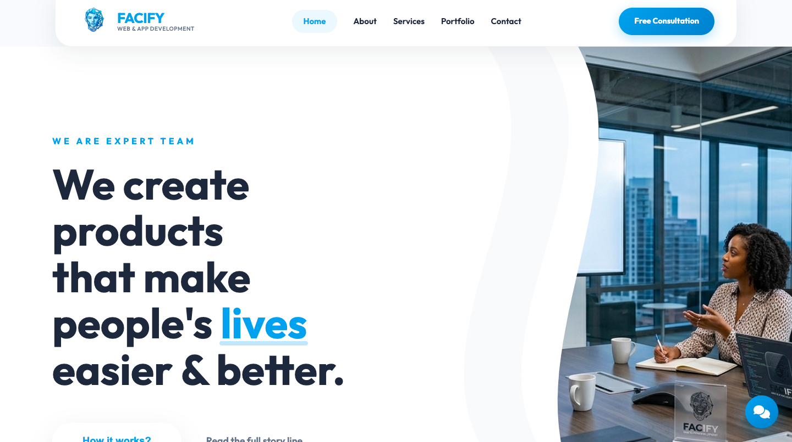

# Facify

Facify is a responsive web application for a digital agency offering web development, software solutions, and social media marketing services. Built and deployed end-to-end, from UI to backend integration to production hosting.

🔗 **Live site:** [facify.web.app](https://facify.web.app)

## Overview

Facify was built to serve as both a working product and a live portfolio piece — a fully functional client-facing web app rather than a static template. It handles routing, dynamic content, and backend data through Firebase.



## Tech Stack

- **Framework:** Angular
- **Language:** TypeScript
- **Styling:** HTML5, CSS3
- **Backend / Data:** Firebase, Firestore
- **Hosting / Deployment:** Firebase Hosting

## Features

- Responsive design across desktop, tablet, and mobile
- Angular component-based architecture with client-side routing
- Firestore integration for storing and retrieving application data
- Deployed to production via Firebase Hosting

## Getting Started

### Prerequisites

- [Node.js](https://nodejs.org/) (LTS recommended)
- [Angular CLI](https://angular.io/cli)

### Installation

```bash
# Clone the repository
git clone https://github.com/redice21-dev/facify.git
cd facify

# Install dependencies
npm install

# Run the development server
ng serve
```

Navigate to `http://localhost:4200/` in your browser. The app will reload automatically if you change any source files.

### Build

```bash
ng build
```

Build artifacts will be stored in the `dist/` directory.

## Deployment

This project is deployed using Firebase Hosting:

```bash
firebase deploy
```

## Author

**Faith Achigbulem**
Software Developer | Frontend & Mobile Application Developer
📧 faith.achigbulem@gmail.com
🔗 [LinkedIn](https://www.linkedin.com/in/faithachigbulem)